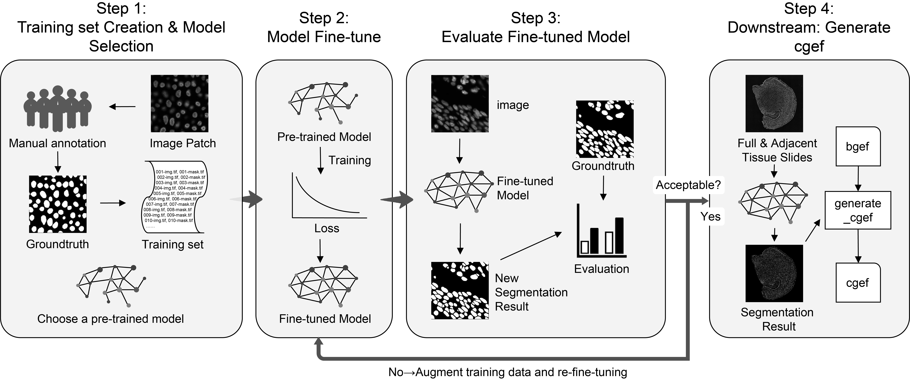

# CSRefiner

A lightweight framework for fine-tuning cell segmentation models with small datasets, optimized for spatial transcriptomics. Efficiently adapt pre-trained models to new tissue types or staining conditions using minimal annotations. Only a small number of training samples are needed to achieve higher cell boundary detection accuracy, thereby obtaining a more accurate cellbin matrix. Supporting:

- **Cellpose**
- **Stardist**
- **CellBin**

Supports multiple image types (e.g., HE, ssDNA, DAPI, mIF), with options for training from scratch or using pretrained models.

The project pipeline is as follow:



---

## Installation
```bash
git clone https://github.com/STOmics/CSRefiner.git
cd CSRefiner
```
Install dependencies (recommended in a virtual environment):

```bash
pip install -r requirements.txt
```
The Cellpose-SAM(cpsam) related processes require a separate environment. Create another virtual environment and install the dependencies:

```bash
conda env create -f environment_cpsam.yml
```
## Prepare Your Data

### Data Selection
Select several (at least `20` are recommended to ensure the fine-tuning effect) `256×256`-sized small images from the entire chip image to be segmented and annotate them as training sets. The selected small images should be representative, especially including parts where the current segmentation results are not satisfactory (such as the hippocampus of the brain).

If necessary, use `tools/crop_image.py` to crop the chip image into `256×256`-sized small images.

```bash
python tools/crop_image.py \
  -i path/to/raw_images \
  -o path/to/output_patches \
  -s 256
```
The default value of the -s parameter is 256.

Input file format must be `.tif`, and the suffixes must be `"-img.tif"` or `"-mask.tif"`.

If filename contains coordinates like `chipA-x512_y512_w256_h256-img.tif,` cropping will retain correct spatial origin.

Output format: `chip_id-xX_yY_wW_hH-img/mask.tif`, useful for traceability.

❗Note: StarDist's H&E-stained segmentation model, `'2D_versatile_he'`, requires an input image size of `512×512` pixels, which differs from the size requirements of other models. If you prefer not to perform additional data preparation, you can use the script `tools/pad_image.py` to pad the image to the required size.

```bash
python tools/pad_image.py \
  -i path/to/images \
  -o path/to/masks \
  -io path/to/padded/images \
  -go path/to/padded/masks \
  -ts target_height target_width
```

### Data Annotation

If your data is not annotated, here is a [tutorial](./docs/Tutorial%20on%20Cell%20Annotation%20Using%20Qupath.md) for manual cell annotation using Qupath.


### Format

Images and masks format should be `.tif`.

Masks format for `Cellpose` and `Stardist` can only be `instance mask(each cell has a unique integer label)`.

If necessary, use `tools/mask_convert.py` to convert mask formats:

```bash
# Instance -> Semantic
python tools/mask_convert.py -i input_folder -o output_folder -m i2s

# Semantic -> Instance
python tools/mask_convert.py -i input_folder -o output_folder -m s2i
```

### Naming Requirements

The only difference between the file names of each image and its corresponding mask is the suffix `"-img.tif"` and `"-mask.tif"`.

## Generate a Training List

```bash
python tools/make_trainset_txt.py \
  -img dataset/images \
  -mask dataset/masks \
  -o trainset_list/my_trainset_list.txt
```

This txt file will be used as a necessary parameter input for subsequent fine-tuning.

## Start Fine-Tuning

### Pre-trained models:
### Cellpose
Cellpose has the following official pre-trained models:

`cpsam`, `cyto3`, `nuclei`, `cyto2_cp3`, `tissuenet_cp3`, `livecell_cp3`, `yeast_PhC_cp3`, `yeast_BF_cp3`, `bact_phase_cp3`, `bact_fluor_cp3`, `deepbacs_cp3`, `cyto2`, `cyto`, `CPx`, `transformer_cp3`, `neurips_cellpose_default`, `neurips_cellpose_transformer`, `neurips_grayscale_cyto2`, `CP`, `CPx`, `TN1`, `TN2`, `TN3`, `LC1`, `LC2`, `LC3`, `LC4`.

It is recommended to use `cpsam`, `cyto3`, `cyto2`, `cyto`, which are the core models of Cellpose.

### Stardist
| key | Modality (Staining) | Image format | Description  |
| :-- | :-: | :-:| :-- |
| `2D_versatile_fluo` `2D_paper_dsb2018` `2D_demo`| Fluorescence (nuclear marker) | 2D single channel| *Versatile (fluorescent nuclei)* and *DSB 2018 (from StarDist 2D paper)* that were both trained on a [subset of the DSB 2018 nuclei segmentation challenge dataset](https://github.com/stardist/stardist/releases/download/0.1.0/dsb2018.zip). 2D_demo is a pre-trained model provided by StarDist for quick testing and demonstration of StarDist's basic features.|
|`2D_versatile_he` | Brightfield (H&E) | 2D RGB    | *Versatile (H&E nuclei)* that was trained on images from the [MoNuSeg 2018 training data](https://monuseg.grand-challenge.org/Data/) and the [TNBC dataset from Naylor et al. (2018)](https://zenodo.org/record/1175282#.X6mwG9so-CN). |

### Cellbin
Download link for the Cellbin(referred to as `"v3"` in all script descriptions below) pre-trained models: https://bgipan.genomics.cn/#/link/2AZUv6JJfC4KqL74Rrn0

Password: 8eGM

Pre-trained models included:

- DAPI/ssDNA: cellseg_bcdu_SHDI_221008_tf.hdf5

- HE: cellseg_bcdu_H_240823_tf.hdf5

### Run the main script:

```bash
python run_finetune.py \
  -m model_name \
  -t stain/type/ss/or/he \
  -f trainset_list/my_trainset_list.txt \
  -p pretrained/model/name/or/path \
  -r 0.9 \
  -b 8 \
  -v 16 \
  -e 100
```

### Required Parameter

| Parameter | Description |
|:----:|:----------:|
|  -m   | Model name: `cellpose` or `v3` or `cpsam` or `stardist`  |
|  -t   | Image type: `ss` or `he` |
|  -f   | Path to `.txt` training list     |

### Optional Parameter

| Parameter | Default | Description |
|:----:|:----------:|:----------:|
|  -p   | None |Pretrained model path/name or scratch. This parameter is not required for fine-tuning cpsam  |
|  -r   | 0.9 |  Train/validation split ratio     |
|  -b   | 6  |Training batch size     |
|  -v   | 16 |Validation batch size    |
|  -e   | 500 | Number of training epochs. For the `v3` and `stardist` model, due to its early stopping mechanism, it is the maximum number of training rounds. For the Cellpose model without early stopping, Cellpose officially recommends training for 100 epochs, and it may help to use more epochs, especially when you have more training data.     |

Example: Fine-tuning the Cellpose Model

```bash
python run_finetune.py \
  -m cellpose \
  -t ss \
  -f trainset_list/my_trainset_list.txt \
  -p cyto \
  -e 100
```
Example: Fine-tuning the Cellpose-SAM Model
```bash
python run_finetune.py \
  -m cpsam \
  -t ss \
  -f trainset_list/my_trainset_list.txt \
  -e 100
```

Example: Fine-tuning the Stardist Model
```bash
python run_finetune.py \
  -m stardist \
  -t ss \
  -f trainset_list/my_trainset_list.txt \
  -p 2D_versatile_fluo \
  -e 100
``` 

Example: Fine-tuning the V3 Model

```bash
python run_finetune.py \
  -m v3 \
  -t ss \
  -f trainset_list/my_trainset_list.txt \
  -p weights/cellseg_bcdu_SHDI_221008_tf.hdf5 \
  -e 500
```

### Output

After training, outputs are saved to `finetuned_models/model_timestamp/`:

`.pth or .hdf5`: Finetuned model

`train_log.json`: Training/validation loss log

`loss_curve.png`: Training/validation loss plot

## Cell Segmentation Using Fine-Tuned Models

### Cellpose

#### Option 1: Use the official Cellpose CLI

```bash
python -m cellpose \
--dir /path/to/image/floder/or/file \
--pretrained_model /path/to/finetuned/model \
--chan 0 \
--save_tif \
--use_gpu \
--savedir /path/to/output/floder
```
Parameter Description:
| Parameter | Description |
|:----------:|:-------------:|
| --dir  | Path to the  input images folder|
| --pretrained_model | Fine-tuned model path (you can also enter `cyto/cyto3` to use the official pre-trained model)|
| --chan | Segmentation channel, default is 0|
| --save_tif | Segmentation results are saved in `.tif` format |
| --use_gpu | Use GPU |
| ---savedir | Output path |

For more parameters, see: [Cellpose CLI — cellpose documentation,](https://cellpose.readthedocs.io/en/latest/cli.html) which can be selected according to actual needs.

#### Option 2: Use the script `/src/segmentor/cellpose_segmentor.py`

Cellpose official CLI does not support input of images that are too large. If you want to segment the entire chip image, use the script `/src/segmentor/cellpose_segmentor.py`:

```bash
python src/segmentor/cellpose_segmentor.py \
-i /path/to/image.tif \
-o /path/to/output/floder \
-p /path/to/finetuned/model
```
Similarly, the `-p` parameter also supports inputting `cyto/cyto3` to use the official pre-trained model.

### Cellpose-SAM
#### Option 1: Use the official Cellpose CLI

```bash
python -m cellpose \
--dir /path/to/image/floder \
--pretrained_model /path/to/finetuned/model \
--save_tif \
--use_gpu \
--savedir /path/to/output/floder
```
Parameter Description:
| Parameter | Description |
|:----------:|:-------------:|
| --dir  | Path to the  input images folder|
| --pretrained_model | Fine-tuned model path (Or use the pre-trained cpsam model without this parameter)|
| --save_tif | Segmentation results are saved in `.tif` format |
| --use_gpu | Use GPU |
| ---savedir | Output path |

#### Option 2: Use the script `src/segmentor/cpsam_segmentor.py`

```bash
python src/segmentor/cpsam_segmentor.py \
-i /path/to/image/floder/or/file  \
-o /path/to/output/floder \
-p /path/to/finetuned/model \
-g
```

### Stardist

```bash
python src/segmentor/stardist_segmentor.py \
-i input/img/path \
-o /path/to/output/floder \
-p /path/to/model 
```

### v3

```bash
python src/segmentor/v3_segmentor.py \
-i input/img/path \
-o /path/to/output/floder \
-p /path/to/model \
-g gpu_index 
```
The input path supports both large-scale images (e.g., whole-slide images) and cropped tiles, as well as batch processing via file or folder paths.

## Evaluation of cell segmentation results
### Use ImageJ
If there is no groundtruth, you can use ImageJ and select `Image`>`Color`>`Merge Channels` to merge the original image and the model segmentation result, and then observe it with the naked eye.

### Calculate cell segmentation evaluation indexs
Run the script `src/evaluation/cell_eval_multi.py` to calculate the five indicators of `'Precision'`, `'Recall'`, `'F1'`, `'jaccrd'`, and `'dice'` and output the bar chart and box plot at the same time.
```bash
python src/evaluation/cell_eval_multi.py \
-g path/to/groundtruth \
-d path/to/model/results \
-o output/path 
```
Assuming the folder structure is as follows, the `-d` parameter is the path of `dt_path`
```markdown
- dt_path
  - cyto
  - cyto_finetuned
  - v3
```

## Use the segmentation results to obtain the cellbin matrix that combines cell location information
```bash
python src/downstream/generate_cgef.py \
-i input/matrix/path \
-o output/path \
-m path/to/mask \
```
Parameter Description:
| Parameter | Description |
|:----------:|:-------------:|
| -i  | Original gene expression matrix (`.gem.gz`/`.gef` format) path |
| -o | Save path of cellbin matrix combined with cell position information|
| -m | Model segmentation result mask file path|